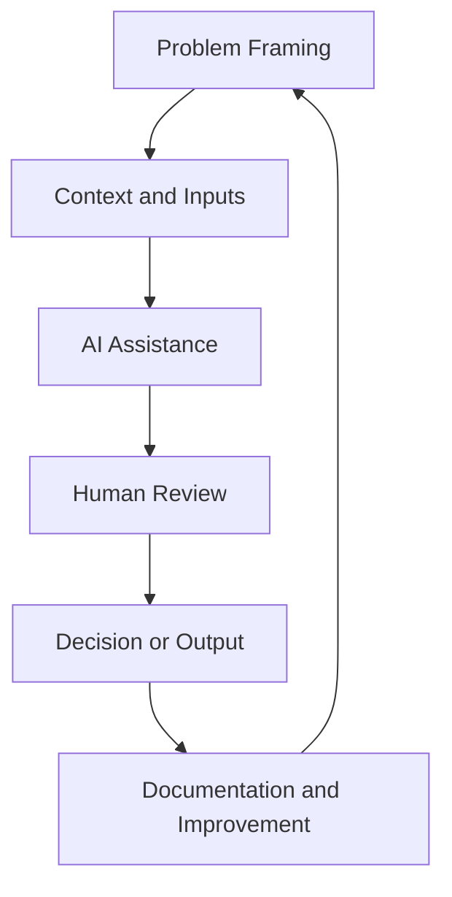

# AI Systems Thinking {#ai-systems-thinking}

:::cdi-message
- **ID:** AIS-001
- **Type:** Core
- **Audience:** Learners, analysts, educators, researchers, professionals, and teams beginning to use AI in structured work
- **Theme:** AI becomes useful when it is placed inside a human-led system
:::

AI is often introduced as a tool.

A chatbot.

A writing assistant.

A coding helper.

A search companion.

A summarizer.

Those uses are helpful, but they are only the beginning.

The real value of AI appears when it is used as part of a system.

A system has a purpose.

It has inputs.

It has a workflow.

It has quality checks.

It has human judgment.

It has outputs that can be reviewed, improved, reused, and trusted.

This chapter introduces AI systems thinking: the habit of designing AI use around problems, people, evidence, decisions, and accountability rather than around isolated prompts.

---

## Why AI Systems Thinking Matters

Many people first experience AI as a conversation.

They ask a question.

The model responds.

They accept, reject, or revise the answer.

That is useful, but it can also create a weak habit: treating AI output as the final product.

AI systems thinking changes the question from:

> What can AI generate?

into:

> What workflow are we building, and where should AI assist?

This shift matters because real work usually requires more than generation.

Real work requires clarity, context, evaluation, documentation, and responsibility.

For example, a learner may ask AI to explain a concept.

An analyst may ask AI to summarize results.

A researcher may ask AI to help structure a report.

A professional may ask AI to draft a decision memo.

In each case, the AI output is not enough by itself.

The human still needs to frame the task, check the output, compare it with evidence, decide what to use, and explain the final result.

That is why CDI treats AI as part of a human-led system.

---

## From AI Tool Use to AI System Design

Tool use asks:

```text
Can this AI help me complete this task?
```

System design asks:

```text
How should this task be structured so AI support is useful, safe, repeatable, and reviewable?
```

The difference is important.

A tool-use mindset often leads to one-off outputs.

A systems mindset creates reusable workflows.

| Tool-use mindset | Systems mindset |
|---|---|
| Ask a prompt | Define the problem |
| Get an answer | Design a workflow |
| Copy useful text | Review and improve output |
| Trust based on fluency | Trust based on checks |
| Start over each time | Reuse templates and patterns |
| Focus on speed | Balance speed, quality, and responsibility |

AI systems thinking does not reject simple AI use.

It improves it.

A good prompt is still useful.

But a good prompt becomes much stronger when it sits inside a clear workflow.

---

## The Human-AI-Human Workflow

The central pattern in this guide is the Human-AI-Human workflow.

```text
Human frames the problem
        ↓
AI assists with generation, reasoning, analysis, or automation
        ↓
Human evaluates, decides, documents, and acts
```

This pattern keeps responsibility in the right place.

The human is not removed from the work.

The human leads the work.

AI contributes support inside the workflow.

The final output is reviewed, interpreted, and owned by the human or team using it.

This is especially important in education, research, data analysis, health, business, leadership, and public communication, where fluent output can look convincing even when it is incomplete or wrong.

---

## What Counts as an AI System?

An AI system does not have to be complex.

It can be small and practical.

For example:

```text
A learner uses AI to explain a concept,
checks the explanation against course notes,
writes their own summary,
and records what they learned.
```

That is a simple AI learning system.

Another example:

```text
An analyst gives AI a cleaned results table,
asks for plain-language interpretation,
checks the interpretation against the data,
creates a figure,
and writes a transparent report.
```

That is an AI-assisted analysis system.

Another example:

```text
A team creates a prompt template,
uses it to classify support requests,
reviews uncertain cases,
tracks errors,
and updates the template over time.
```

That is an operational AI workflow.

The common feature is not complexity.

The common feature is structure.

---

## Core Components of AI Systems Thinking

AI systems thinking includes five core components.



### Problem Framing

The human defines what needs to be done and why it matters.

A weakly framed problem produces weak AI support.

A clearly framed problem gives the AI a useful role.

### Context and Inputs

AI needs context.

This may include goals, audience, data, examples, constraints, definitions, previous decisions, or quality criteria.

Better context usually leads to better output.

### AI Assistance

AI can assist with generation, summarization, comparison, coding, analysis planning, translation, explanation, documentation, and workflow design.

But assistance is not the same as authority.

### Human Review

The human checks whether the output is accurate, appropriate, complete, and useful.

Review may include fact-checking, data validation, expert judgment, ethical reflection, or stakeholder review.

### Documentation and Improvement

A system improves when people document what worked, what failed, and what should change next time.

This can be as simple as saving a prompt template or as formal as maintaining an evaluation log.

---

## AI Systems Are Socio-Technical Systems

AI systems are not only technical.

They are socio-technical.

This means they include both technology and people.

They include:

- users,
- learners,
- teams,
- organizations,
- data,
- tools,
- policies,
- incentives,
- risks,
- decisions,
- and consequences.

A model may generate text, code, or analysis.

But people decide where the model is used, what data it sees, what outputs are accepted, and what actions follow.

That is why AI systems thinking must include human responsibility, not only technical capability.

---

## Where Thinking with AI Fits

Thinking with AI and AI Systems are closely related, but they are not identical.

Thinking with AI focuses on how a person uses AI to think better.

It supports questioning, reasoning, reflection, learning, creativity, critique, and decision-making.

AI Systems expands that mindset into workflows that can be repeated, evaluated, documented, and shared.

```text
Thinking with AI
        ↓
Human-AI-Human reasoning loop
        ↓
AI Systems
        ↓
Reusable workflows, evaluation, governance, and impact
```

In other words, Thinking with AI is the reasoning layer.

AI Systems is the workflow layer.

Both belong together.

---

## A Practical Example

Suppose a learner wants to understand a difficult topic.

A simple AI interaction may look like this:

```text
Explain machine learning in simple terms.
```

That may produce a useful answer.

But a systems-thinking version is stronger:

```text
Goal: Understand machine learning well enough to explain it to beginners.
Audience: Secondary school or early university learners.
Task: Explain the concept using simple language, one analogy, and one practical example.
Quality check: Avoid exaggeration. Clearly distinguish data, model, training, prediction, and evaluation.
Output: A short teaching note followed by three review questions.
```

The second version gives the AI a role inside a learning workflow.

It defines the goal.

It defines the audience.

It defines quality expectations.

It defines the output.

The learner can then review, revise, and save the final explanation.

That is AI systems thinking in practice.

---

## Common Failure Modes

AI systems thinking helps reduce common failures.

| Failure mode | What happens | Systems response |
|---|---|---|
| Vague prompting | Output is generic | Clarify goal, audience, and constraints |
| Over-trust | Fluent output is accepted too quickly | Add review and evidence checks |
| No documentation | Good workflows are lost | Save prompts, decisions, and outputs |
| No evaluation | Errors repeat | Track quality and failure patterns |
| Human removed too early | AI output becomes unowned | Keep human review and responsibility |
| Tool chasing | Focus shifts to novelty | Return to the problem and workflow |

The goal is not to make AI perfect.

The goal is to design workflows where AI can be useful without removing judgment.

---

## CDI Working Principle

In CDI guides, AI is treated as a capability inside a broader data, learning, and decision system.

The working principle is:

```text
AI should make human work clearer, faster, more reflective, and more reproducible.
It should not replace thinking, evidence, accountability, or communication.
```

This principle will guide the rest of the book.

---

## Chapter Summary

AI systems thinking moves us beyond isolated AI prompts.

It asks us to design workflows where AI has a clear role, humans remain responsible, and outputs can be reviewed and improved.

The Human-AI-Human workflow is the central pattern:

```text
Human frames the problem.
AI assists.
Human evaluates, decides, documents, and acts.
```

This chapter also positioned Thinking with AI as the reasoning layer and AI Systems as the workflow layer.

Together, they support responsible, reproducible, human-led AI use.

---

## Looking Ahead

The next chapter introduces AI literacy and responsible use.

We will move from systems thinking into the practical knowledge learners need to understand what AI can do, where it can fail, and how to use it safely and productively.
