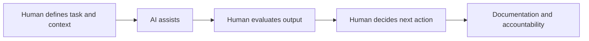

# AI Literacy and Responsible Use {#ai-literacy-and-responsible-use}

:::cdi-message
- **ID:** AI-002
- **Type:** Core
- **Audience:** Beginners to Intermediate Learners
- **Theme:** Responsible AI use starts with understanding what AI can and cannot do
:::

AI literacy is not the same as knowing how to use a chatbot.

A person can write prompts every day and still misunderstand what AI is doing.

A person can receive useful answers from AI and still fail to evaluate whether those answers are accurate, safe, complete, or appropriate for the situation.

AI literacy means understanding AI well enough to use it responsibly.

It means knowing when AI can help.

It means knowing when human judgment matters more.

It means knowing how to ask better questions, evaluate outputs, protect sensitive information, and avoid turning AI assistance into unsupported claims.

In this guide, AI literacy is not treated as a small beginner topic.

It is the foundation for every responsible AI system.

---

## Why AI Literacy Matters

AI systems can generate text, summarize documents, draft code, organize ideas, assist with analysis, and support decision-making workflows.

But AI systems can also produce confident errors.

They can omit important context.

They can reflect bias from training data or user framing.

They can overgeneralize.

They can create outputs that sound polished but are not ready to use.

This is why AI literacy must come before automation.

A weak user with a powerful AI tool can produce weak work faster.

A skilled user with a well-designed workflow can use AI to improve clarity, productivity, reasoning, documentation, and system design.

The difference is not only the tool.

The difference is the human workflow around the tool.

---

## AI Literacy Is a Human Skill

AI literacy includes several practical abilities.

These abilities help a person use AI as an assistant rather than as an unchecked authority.

```text
AI literacy includes the ability to:

1. Understand what AI tools are good at.
2. Understand where AI tools can fail.
3. Frame tasks clearly.
4. Provide useful context.
5. Evaluate outputs critically.
6. Protect private and sensitive information.
7. Document how AI was used.
8. Decide when expert review is needed.
```

This is why AI literacy belongs inside the Human–AI–Human model.

The human begins the process by defining the task.

The AI assists.

The human returns to evaluate, revise, decide, and act.



AI literacy is the skill that keeps this loop responsible.

---

## What AI Can Do Well

AI tools are useful when the task benefits from language, pattern recognition, structured thinking, summarization, synthesis, or repetitive transformation.

Examples include:

```text
Useful AI-supported tasks:

- Drafting an outline
- Summarizing a document
- Rewriting text for clarity
- Creating checklists
- Explaining unfamiliar concepts
- Brainstorming alternatives
- Generating first-pass code
- Reviewing code structure
- Turning notes into documentation
- Comparing options
- Designing workflows
- Creating templates
```

These are powerful uses.

But most of them are not final-answer tasks.

They are support tasks.

AI can accelerate the work, but the human remains responsible for whether the output is correct, complete, ethical, and appropriate.

---

## What AI Does Not Guarantee

AI output should not be treated as guaranteed truth.

AI does not automatically guarantee:

```text
AI does not guarantee:

- factual accuracy
- completeness
- fairness
- privacy protection
- legal correctness
- medical correctness
- financial correctness
- statistical validity
- source reliability
- reproducibility
- suitability for a specific audience
```

This does not make AI useless.

It means AI must be used inside a system that includes evaluation.

In CDI guides, we treat AI output like any other analytical output.

It must be inspected.

It must be tested.

It must be interpreted in context.

It must be documented before it becomes part of a decision.

---

## Responsible Use Starts With Task Classification

Not every AI task carries the same level of risk.

A low-risk task may only need a quick review.

A high-risk task may require source verification, expert review, privacy checks, and formal documentation.

One practical habit is to classify the task before using AI.

```text
Low-risk tasks:
- brainstorming titles
- improving grammar
- summarizing personal notes
- drafting non-sensitive outlines

Moderate-risk tasks:
- drafting public educational content
- creating code for analysis
- interpreting a dataset
- preparing internal documentation

High-risk tasks:
- medical, legal, or financial advice
- decisions affecting people
- clinical interpretation
- hiring or evaluation decisions
- use of private or sensitive data
- claims that require strong evidence
```

The higher the risk, the stronger the review process must be.

---

## The Responsible AI Use Checklist

Before using AI output, ask the following questions.

```text
Responsible AI use checklist:

[ ] Did I define the task clearly?
[ ] Did I provide enough context?
[ ] Did I avoid sharing sensitive information unnecessarily?
[ ] Did I check the output for factual errors?
[ ] Did I check whether sources are needed?
[ ] Did I check whether expert review is required?
[ ] Did I revise the output for my actual audience?
[ ] Did I document how AI was used when appropriate?
[ ] Did I remain responsible for the final decision?
```

This checklist is simple, but it changes how AI is used.

It moves the user from passive acceptance to active evaluation.

---

## Privacy and Sensitive Information

Responsible AI use requires careful handling of private and sensitive information.

A practical rule is to avoid sharing unnecessary details.

Instead of pasting sensitive raw information into an AI tool, consider whether the task can be reframed using synthetic, anonymized, or summarized data.

```text
Unsafe pattern:
Paste private records directly into an AI tool without considering privacy.

Safer pattern:
Remove identifiers, summarize the structure, or use synthetic examples when the real details are not needed.
```

This is especially important for clinical, educational, financial, employment, and personal data.

In AI Systems, privacy is not an afterthought.

It is part of workflow design.

---

## From AI Literacy to AI Systems

AI literacy begins with individual responsibility.

AI systems extend that responsibility into repeatable workflows.

The difference looks like this:

```text
AI literacy question:
Can I use this AI tool responsibly for this task?

AI systems question:
Can this AI-supported workflow be repeated, evaluated, documented, and improved?
```

This distinction matters.

A literate AI user can produce better individual outputs.

A well-designed AI system can produce better organizational workflows.

The goal of this guide is to move from the first to the second.

---

## Common Failure Modes

Many AI problems are not caused by the model alone.

They are caused by poor workflow design.

Common failure modes include:

```text
Common failure modes:

1. Unclear task framing
2. Missing context
3. Overtrusting fluent output
4. No evaluation step
5. No documentation
6. No privacy review
7. No human ownership
8. Using AI for a task that requires expert judgment
9. Automating before understanding the workflow
10. Treating AI output as a finished product
```

These failure modes are preventable.

The solution is not to avoid AI.

The solution is to design better human-led systems around AI.

---

## Practical Example: Rewriting an Output Responsibly

Imagine a learner asks AI to summarize a technical article.

A weak workflow might look like this:

```text
Prompt:
Summarize this article.

Action:
Copy the AI summary into a report.
```

A stronger workflow looks like this:

```text
Prompt:
Summarize this article for a beginner audience.
Highlight the main claim, key evidence, limitations, and any terms that need explanation.

Review:
Compare the summary with the original article.
Check whether limitations were included.
Revise unclear language.
Add citation or source information.
Document that AI was used for first-pass summarization.
```

The tool may be the same.

The system is different.

The second workflow is more responsible because it includes context, evaluation, revision, and documentation.

---

## Key Takeaways

AI literacy is the foundation of responsible AI systems.

AI can assist with many tasks, but it does not remove the need for human judgment.

Responsible use requires task framing, privacy awareness, output evaluation, and documentation.

The Human–AI–Human workflow helps keep AI use human-led.

The next step is to move from responsible use into problem framing, where we define what should and should not become an AI-supported task.

---

## Looking Ahead

The next chapter focuses on problem framing for AI.

We will move from responsible use into the practical skill of deciding what problem is being solved, who the workflow serves, what success looks like, and whether AI is appropriate for the task.

This is where AI work begins to shift from tool use into system design.
